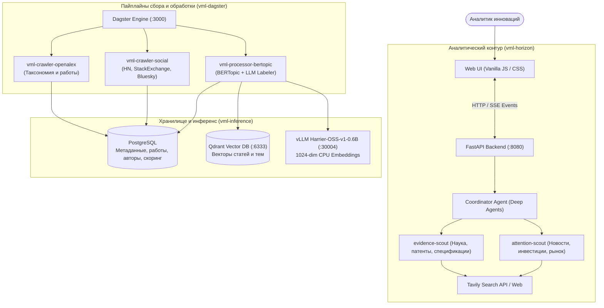

# VibeML (VML) · Weak Signal Intelligence Platform

> Автоматизированный программный комплекс сбора, обработки и выявления слабых сигналов и зарождающихся научно-технологических трендов (TRL 1–3) для аналитиков инноваций.
>
> Решение разработано в рамках хакатона «Лидеры цифровой трансформации 2026» (Кейс Газпромбанка).

---

## Оглавление

1. [О проекте](#о-проекте)
2. [Архитектура решения](#архитектура-решения)
3. [Структура репозитория](#структура-репозитория)
4. [Технологический стек](#технологический-стек)
5. [Методология выявления слабых сигналов](#методология-выявления-слабых-сигналов)
6. [Быстрый старт (Локальный запуск)](#быстрый-старт-локальный-запуск)
7. [Компоненты системы](#компоненты-системы)
   - [vml-horizon — Аналитическая рабочая станция](#1-vml-horizon)
   - [vml-crawler-openalex — Научный краулер](#2-vml-crawler-openalex)
   - [vml-crawler-social — Мониторинг внимания](#3-vml-crawler-social)
   - [vml-processor-bertopic — Тематическое моделирование](#4-vml-processor-bertopic)
   - [vml-inference — Сервинг моделей и векторная база](#5-vml-inference)
   - [vml-dagster — Оркестрация пайплайнов](#6-vml-dagster)
8. [Соответствие критериям оценки](#соответствие-критериям-оценки)

---

## О проекте

Классические методы мониторинга фиксируют сформировавшиеся тренды на стадиях мейнстрима или инвестиционного перегрева. **VibeML** автоматизирует работу аналитика на самом раннем этапе (TRL 1–3 — формулирование концепций, лабораторные эксперименты, доказательства концепции).

Система решает две ключевые задачи:
1. **Обработка открытого запроса в реальном времени**: многоагентный поиск (`vml-horizon`), глубокий фактчекинг по первичным источникам, фильтрация зрелых рынков и хайпа, формирование ранжированного **ТОП-15 зарождающихся трендов** с оценкой TRL, кейсами, источниками и банковскими гипотезами за время до 20 минут.
2. **Систематический сбор и семантическая аналитика**: непрерывный сбор научной литературы (OpenAlex) и индикаторов внимания в соцмедиа (HN, Stack Exchange, Bluesky), расчет 1024-мерных эмбеддингов (Harrier), кластеризация через BERTopic и автоматическая разметка через LLM.

---

## Архитектура решения



---

## Структура репозитория

Монорепозиторий объединяет все сервисы системы:

| Директория | Назначение | Технологии |
|---|---|---|
| [`vml-horizon/`](vml-horizon/) | Рабочая станция аналитика: Web UI, FastAPI, Deep Agents координатор и скауты открытого поиска | Python 3.14, FastAPI, Deep Agents, Tavily, LangChain |
| [`vml-crawler-openalex/`](vml-crawler-openalex/) | Сбор полного корпуса научных публикаций OpenAlex, снэпшоты, API рефреш, версионирование | Python 3.14, Dagster, SQLAlchemy, PostgreSQL, Parquet |
| [`vml-crawler-social/`](vml-crawler-social/) | Сбор упоминаний в Hacker News, Stack Exchange, Bluesky; расчет динамики массового внимания | Python 3.14, Dagster, SQLAlchemy, Algolia API, Bluesky API |
| [`vml-processor-bertopic/`](vml-processor-bertopic/) | Векторизация аннотаций, тематическое моделирование BERTopic, разметка тем через LLM (Qwen) | Python 3.14, BERTopic, Qdrant, HDBSCAN, Tokenizers |
| [`vml-inference/`](vml-inference/) | Инфраструктура инференса моделей и векторный поиск (Docker Compose конфигурации) | vLLM (CPU), Microsoft Harrier-OSS-v1-0.6B, Qdrant |
| [`vml-dagster/`](vml-dagster/) | Центральный оркестратор Dagster, multi-container среда исполнения задач | Docker Compose, Dagster Daemon, Dagster Webserver |

---

## Технологический стек

- **Ядро и среда исполнения**: Python 3.14, менеджер зависимостей [uv](https://docs.astral.sh/uv/).
- **Бэкенд и API**: FastAPI, Uvicorn, Pydantic v2, Structlog.
- **Агентный фреймворк**: Deep Agents, LangChain OpenAI/Tavily.
- **Машинное обучение и NLP**:
  - `microsoft/harrier-oss-v1-0.6b` (оптимизированный под CPU инференс через vLLM, 1024-dim L2-normalized векторы).
  - `BERTopic` + `c-TF-IDF` + `HDBSCAN` + `UMAP`.
  - Промпт-пайплайны разметки и верификации тем.
- **Базы данных и хранилище**:
  - `PostgreSQL 16` (структурированные сущности, таксономия, авторы, наблюдения, версионирование).
  - `Qdrant v1.19` (векторный индекс для семантического поиска).
  - Локальный слой Parquet для сырых срезов данных.
- **Оркестрация и контейнеризация**: Dagster 1.13, Docker, Docker Compose.

---

## Методология выявления слабых сигналов

В соответствии с методологическими требованиями и спецификой задач инновационного анализа банка, слабый сигнал определяется как **раннее, формирующееся научно-технологическое решение**:

1. **Критерии включения**:
   - **TRL 1–3**: фундаментальные принципы, подтвержденная концепция или первые лабораторные прототипы.
   - **Научно-патентная активность**: наличие рецензируемых публикаций, препринтов (arXiv/bioRxiv) или первичных патентных заявок за последние 1–2 года.
   - **Конвергенция источников**: независимые подтверждения из нескольких академических или прикладных центров.

2. **Критерии строгого исключения (Фильтрация шума и зрелости)**:
   - **Зрелые технологии**: устоявшийся коммерческий рынок, отраслевые стандарты (ISO, IEEE), готовые коробочные продукты (TRL 7–9).
   - **Инвестиционный перегрев**: массовые поздние венчурные раунды (Series B+), оценка свыше десятков миллионов долларов.
   - **Маркетинговый хайп**: взрывной интерес в непрофильных медиа при отсутствии научно-инженерных доказательств.

3. **Формат итоговой карточки ТОП-15 трендов**:
   - Название технологии и синонимы (aliases).
   - Сущность технологии и решаемая проблема.
   - Потенциальное конкурентное преимущество.
   - Задокументированный кейс-пример / прототип.
   - Проверяемые первоисточники (DOI, ссылки на статьи, патенты).
   - Оценка уровня зрелости (TRL) и обоснование отнесения к зарождающемуся тренду.
   - **Гипотеза применения для банковского сектора** (FinTech, безопасность, инфраструктура, автоматизация).

---

## Быстрый старт (Локальный запуск)

### Требования
- Linux x86_64 / macOS
- Python >= 3.14
- Менеджер пакетов [uv](https://docs.astral.sh/uv/) (`curl -LsSf https://astral.sh/uv/install.sh | sh`)
- Docker и Docker Compose v2
- PostgreSQL 16+

---

### 1. Запуск инфраструктуры (Qdrant и модели)

```bash
# Векторная база данных Qdrant
cd vml-inference/qdrant
docker compose up -d

# Локальный легковесный инференс эмбеддингов Harrier (CPU)
cd ../harrier-oss-v1-0.6b
docker compose up -d --wait
python3 test_embeddings.py  # проверка работоспособности (7 тестов)
cd ../..
```

---

### 2. Запуск аналитической панели (Horizon)

Horizon предоставляет веб-интерфейс аналитика и агентный модуль открытого поиска.

```bash
cd vml-horizon

# Установка зависимостей в изолированное виртуальное окружение
uv sync

# Конфигурация окружения
cp .env.example .env
```

Настройте переменные в `.env`:
```env
HORIZON_MODEL=gpt-4o-mini                    # или compatible-провайдер
HORIZON_MODEL_BASE_URL=https://api.openai.com/v1
HORIZON_MODEL_API_KEY=sk-...
HORIZON_TAVILY_API_KEY=tvly-...             # ключ поиска Tavily
HORIZON_HOST=127.0.0.1
HORIZON_PORT=8080
```

Запустите сервис:
```bash
uv run python -m api
```

Откройте интерфейс в браузере: **http://127.0.0.1:8080**
- Перейдите во вкладку **Research**.
- Введите тему для анализа (например, `microfluidic diagnostics outside clinical labs` или `post-quantum cryptography for banking core`).
- Нажмите **Start research** — система запустит координатора и двух скаутов, отобразит ход мыслей и фактчекинга в реальном времени, сформировав отчет `/final_report.md`.

---

### 3. Запуск пайплайнов сбора и обработки данных (Dagster)

Пайплайны сбора научных работ и анализа внимания оркеструются через Dagster.

#### Сбор OpenAlex
```bash
cd vml-crawler-openalex
uv sync
cp .env.example .env   # укажите DATABASE_URL и OPENALEX_API_KEY

# Сбор таксономии OpenAlex
uv run dagster job execute -m src.ingestion.job -j taxonomy_job

# Загрузка и фильтрация работ
uv run dagster job execute -m src.ingestion.job -j snapshot_job
cd ..
```

#### Сбор индикаторов социального внимания
```bash
cd vml-crawler-social
uv sync
cp .env.example .env   # укажите DATABASE_URL (OpenAlex DB)

# Сбор упоминаний HN, StackExchange, Bluesky и расчет attention-метрик
uv run dagster job execute -m src.collection.defs -j social_job
cd ..
```

#### Тематическое моделирование BERTopic
```bash
cd vml-processor-bertopic
uv sync
cp .env.example .env   # настройте доступ к Postgres, Qdrant и Harrier

# Запуск пайплайна векторизации и выявления кластеров
uv run dagster job execute -m src.orchestration.defs -j discovery_topics_job
cd ..
```

---

## Компоненты системы

### 1. `vml-horizon`
Интерактивное рабочее место исследователя технологий.
- **Координатор исследований**: многоагентный граф на базе Deep Agents.
- **`evidence-scout`**: специализированный агент, собирающий научно-патентные свидетельства, препринты и экспериментальные данные.
- **`attention-scout`**: агент валидации рыночной стадии, проверяющий наличие инвестиций, коммерческих внедрений и хайпа.
- **Стриминг событий (SSE)**: прозрачная визуализация шагов агента для аналитика.

### 2. `vml-crawler-openalex`
Инфраструктура работы с научным корпусом:
- Индексация таксономии (домены, области, субполя, темы).
- Инкрементальный сбор свежих препринтов и статей через Partitioned API.
- Версионирование состояний выборки в PostgreSQL и сохранение сырых данных в Parquet.

### 3. `vml-crawler-social`
Анализатор поверхностного внимания:
- Сбор данных из Hacker News (Algolia API), Stack Exchange API и Bluesky.
- Агрегация ежемесячного объема упоминаний (`social.attention`) по темам OpenAlex.
- Индикатор ранней фазы: обнаружение всплесков активности профильного сообщества до появления публикаций в СМИ.

### 4. `vml-processor-bertopic`
Модуль тематического анализа:
- Векторизация текстовых абстрактов батчами через параллельный HTTP-клиент.
- Кластеризация HDBSCAN на сниженной UMAP-размерности.
- Извлечение ключевых слов (`c-TF-IDF`) и автоматическая генерация емких наименований тем через LLM с контролем галлюцинаций.

### 5. `vml-inference`
Автономный стек инференса:
- Оптимизированный контейнер vLLM для процессоров Intel/AMD без потребности в GPU.
- Полноразмерная модель `microsoft/harrier-oss-v1-0.6b` (1024-dim, FP32).
- Векторная база данных Qdrant для высокоскоростного поиска ближайших соседей (HNSW).

### 6. `vml-dagster`
Оркестратор промышленного уровня:
- Разделение контейнеров инфраструктуры и рабочих сред (до 4 параллельных запусков).
- Полная изоляция зависимостей и изоляция доступа к БД.

---

## Соответствие критериям оценки

| Критерий хакатона | Реализация в VibeML |
|---|---|
| **Выявление слабых сигналов (TRL 1–3)** | Двухуровневая фильтрация: отсев технологий со сформированным рынком и фокус на рецензируемых публикациях и лабораторных проверках концепций. |
| **Обработка открытого запроса** | Произвольный ввод темы в Horizon, автоматическое построение поискового профиля, динамический сбор данных по внешним источникам. |
| **Качество выдачи ТОП-15** | Строгий скоринг, исключение дубликатов через семантический кластеринг, проверка конвергенции независимых источников. |
| **Проверяемость и первоисточники** | Каждое утверждение привязано к конкретному URL, DOI или патенту с указанием уровня доверия к источнику. |
| **Интерпретируемость решения** | Полная прозрачность логики включения технологии в итоговый список и структурированное обоснование отсутствия зрелости. |
| **Практическая ценность для банка** | Для каждого тренда формулируется конкретная гипотеза внедрения в банковские и финтех-процессы. |
| **Готовность прототипа** | Развернутый веб-интерфейс, готовые Docker Compose сценарии и Dagster-пайплайны полного цикла. |

---

## Тестирование

Запуск тестов по всем модулям:

```bash
# Horizon
uv run --directory vml-horizon pytest

# OpenAlex Crawler
uv run --directory vml-crawler-openalex pytest

# Social Crawler
uv run --directory vml-crawler-social pytest

# Topic Processor
uv run --directory vml-processor-bertopic pytest -m "not slow"
```
