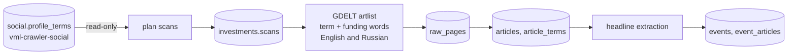

# Investment collection design

Implements the collection half of vml-trends [trends-05](../../vml-trends/docs/agents/tasks/trends-05-investments-task.md). The funding status and multiplier are computed in [vml-signals](../../vml-signals/docs/features.md).

## Source decision

| Source | Result of a live check (2026-09-27) | Decision |
| --- | --- | --- |
| GDELT DOC 2.0 | Free, no key, archive back to 2017, up to 250 articles per query; found "Atrandi Biosciences Raises $25M in Series A" in three outlets | **Used** |
| SEC EDGAR Form D | Free full-text search, but "microfluidic" returns 0 filings: Form D has no technology description, so filings cannot be linked to topics | Not used |
| SEC EDGAR 8-K | Mentions of terms and "series A" exist in public-company filings, but they describe securities, not startup rounds | Not used |
| Crunchbase, Dealroom, PitchBook | Paid | Not used without a contract |

## Data flow

1. **Terms.** Terms come from the newest social profile. Topic names are always searched; OpenAlex keywords need at least `INVESTMENTS_MIN_KEYWORD_WORDS` words, because single words like "Design" match unrelated news.
2. **Scans.** Each search pairs a term with funding words (`raises`, `funding`, `series a`, `seed`, `acquires`, `ipo`, `grant`…) and runs once per source language in `INVESTMENTS_LANGUAGES` (default English and Russian, `sourcelang:`). A window that returns the full 250 articles is split in half; a single month is marked `truncated`.
3. **Articles.** Articles are deduplicated by URL. `article_terms.in_title` marks a strong link: the term appears in the headline, not only in the body.
4. **Events.** Rules in `src/collection/extraction.py` read English or Russian headlines (the language is detected by Cyrillic):
   - event type: `vc_round`, `m_and_a`, `ipo`, `grant`;
   - stage, amount, and currency;
   - company (a «quoted» name, else the subject before the verb);
   - lead investors (`led by`, «при участии»).

   Market-size reports are ignored. Reprints with the same company, type, stage, rounded amount, and month form one event (the origin group).

## Russian segment

GDELT translates Russian-language articles into English and searches that translation. The English OpenAlex terms therefore find Russian news, while the headlines come back in Russian.

- A separate `russian` scan per term and window (column `scans.language`).
- Russian headline rules cover:
  - rounds: «привлек 300 млн рублей», «посевной раунд», «серии А»;
  - grants: «получила грант»;
  - M&A: «приобрел», «купил», «поглотил»;
  - IPO: «разместил акции», «IPO»;
  - amounts in рублях, долларах, евро;
  - companies in «кавычках»;
  - investors: «при участии», «во главе с».
- vml-signals counts a topic as fully covered only when both languages are scanned.

Checked but not used for the backfill: RSS of sk.ru, vc.ru, rb.ru, CNews, Inc. Russia, and TAdviser. They hold only the latest 10–250 items, so they give no history since 2020. fasie.ru rejects requests (403), and rfrit.ru has no feed. RSS remains an option for forward-only collection.

## Rate limits

GDELT asks for one request per five seconds, and a burst quickly leads to long 429 blocks for the IP. The client:
- keeps at least `INVESTMENTS_REQUEST_INTERVAL` seconds (default 10) between requests;
- backs off 30, 60, and 120 seconds on 429;
- if 429 persists, stops the run and returns the scan to the queue, so it is neither failed nor treated as empty.

## Limitations

- Only headlines are parsed, so rounds described only in the article body are missed.
- Machine translation limits recall for Russian news: a term matches only when the translation uses it.
- GDELT matches the term anywhere in the text. Use `in_title` links for scoring; `vml-signals` does this by default.
- Currency conversion in `vml-signals` uses approximate static rates, for thresholds only.
