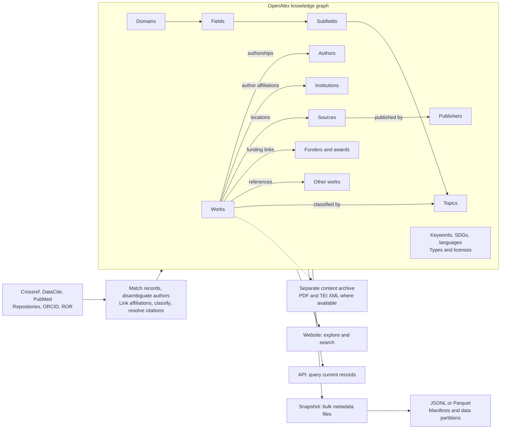
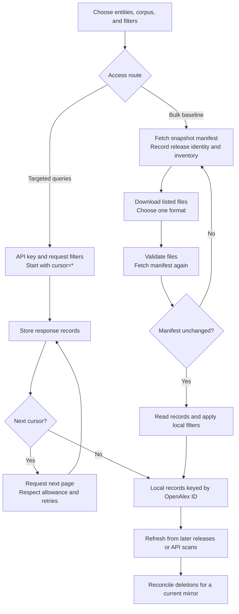

# OpenAlex architecture

A quick guide to OpenAlex's public data model and delivery interfaces. Official documentation checked September 26, 2026. For this project's jobs and storage, see [Ingestion](ingestion.md).

## Building blocks



This is a conceptual map of public building blocks. OpenAlex gathers metadata, resolves entities, and connects them around works. The diagram does not specify its internal deployment topology. Sources: [How it is built](https://help.openalex.org/data/how-its-built/), [data model](https://help.openalex.org/data/), [topic hierarchy](https://help.openalex.org/data/topics/), and [access products](https://help.openalex.org/access/overview/).

## Work types

Each work has one `type`. OpenAlex defines these 25 values. [Official vocabulary](https://help.openalex.org/data/work-types/) (checked September 28, 2026).

| Type                      | Valuable | Description                                        |
| ------------------------- | -------- | -------------------------------------------------- |
| `article`                 | Yes      | Original research, usually journal-published.      |
| `book`                    |          | Complete scholarly volume.                         |
| `book-chapter`            |          | Individual book section.                           |
| `book-review`             |          | Assessment of one book.                            |
| `conference-abstract`     |          | Meeting abstract without a full paper.             |
| `conference-paper`        | Yes      | Full conference contribution.                      |
| `data-paper`              |          | Paper describing data.                             |
| `dataset`                 |          | Data artifact itself.                              |
| `dissertation`            |          | Degree or qualification thesis.                    |
| `editorial`               |          | Broad-topic opinion or commentary.                 |
| `erratum`                 |          | Published correction notice.                       |
| `letter`                  |          | Reader correspondence about published material.    |
| `libguides`               |          | Librarian-curated resource guide.                  |
| `other`                   |          | Material outside other categories.                 |
| `paratext`                |          | Publication framing: covers, contents, guidelines. |
| `peer-review`             |          | Evaluation of a specific work.                     |
| `preprint`                | Yes      | Article primarily hosted in a preprint repository. |
| `reference-entry`         |          | Encyclopedia, dictionary, or handbook entry.       |
| `report`                  |          | Institutional report or working paper.             |
| `retraction`              |          | Notice withdrawing an earlier work.                |
| `review`                  |          | Synthesis of existing research.                    |
| `software`                |          | Citable code artifact.                             |
| `software-paper`          |          | Paper describing software.                         |
| `standard`                |          | Formal technical specification.                    |
| `supplementary-materials` |          | Files supporting a primary publication.            |

The vocabulary marks `book-review`, `conference-abstract`, `conference-paper`, `data-paper`, and `software-paper` as rolling out; coverage may be low or zero.

## Getting data



Use snapshots for bulk acquisition and the API for focused queries. Cursor paging starts with `cursor=*`, follows `meta.next_cursor`, and supports up to 100 records per page. Persist progress while paging. [Paging reference](https://help.openalex.org/api/paging/).

Public snapshots are anonymous downloads refreshed quarterly; paid plans offer daily snapshots. Public releases replace the bucket's contents. Preserve the manifest and recheck it after downloading to detect a release change. For ongoing synchronization, ingest changed records by ID and reconcile deletions. Premium API update-date filters support incremental subset synchronization. [Sync contract](https://help.openalex.org/access/sync/).

Basic API queries work without a key; a free API key increases the allowance and supports usage tracking. Check available credits before collecting; a local request cap is separate from the upstream allowance. [Authentication](https://help.openalex.org/api/authentication/).

## Snapshot layout

```text
s3://openalex/data/
├── parquet/
│   ├── manifest.json                 # combined entity manifest
│   └── works/
│       ├── manifest.json             # works inventory
│       ├── deleted_ids.csv.gz
│       └── updated_date=YYYY-MM-DD/
│           └── part_0000.parquet
└── jsonl/                            # alternative format
    └── ...
```

Other entities have their own folders. Choose one format; both contain the dataset. A snapshot's `updated_date` partitions differ from the publication-date partitions used by this crawler's API scheduler. [Snapshot reference](https://help.openalex.org/access/snapshot/).

## Details

### Manifest

The manifest (`manifest.json`) is the official index and packing list for an OpenAlex entity dump (for example, `https://openalex.s3.amazonaws.com/data/parquet/works/manifest.json`). Rather than providing the dataset in a single monolithic archive, OpenAlex distributes records across thousands of partition files and publishes `manifest.json` as the authoritative catalog.

It contains:

- **Release header and dataset totals:**
  - `date`: Release date when the snapshot was generated (e.g. `2026-09-23`).
  - `entity`: Target entity type (e.g. `works`).
  - `format`: Data serialization format (`parquet` or `jsonl`).
  - `record_count`: Total record count across all files in the release (e.g. ~476M works).
  - `content_length`: Total dataset size in bytes across all files (e.g. ~707 GB).
- **File inventory (`files`):**
  - An array of individual part file entries partitioned by `updated_date=YYYY-MM-DD/part_XXXX.parquet`.
  - Exact S3 storage location (`url`).
  - Per-file metadata (`meta`): `content_length` (byte size), `record_count`, and checksums (`sha256` or `md5`).

## Glossary

### Data model

| Term                       | Meaning                                                                                                                                                             |
| -------------------------- | ------------------------------------------------------------------------------------------------------------------------------------------------------------------- |
| Entity / OpenAlex ID       | An identifiable graph object, such as a work (`W…`) or author (`A…`), linked by its OpenAlex ID.                                                                    |
| Work                       | A research output, such as an article, book, or dataset.                                                                                                            |
| Author / institution       | A researcher and an organization associated with research.                                                                                                          |
| Authorship                 | A work's embedded association between an author and their affiliations.                                                                                             |
| Source / location          | A source is a venue, such as a journal or repository. A location describes a work's availability at a venue.                                                        |
| Publisher / funder / award | A publishing organization, a funding organization, and a grant or funding award.                                                                                    |
| Taxonomy                   | Subject hierarchy: domain, field, subfield, topic, from broadest to most specific.                                                                                  |
| Primary topic              | The work's highest-ranked topic assignment.                                                                                                                         |
| Core / XPAC                | Core is the default API corpus; XPAC is the expansion corpus. Snapshots include both. Use `corpus=all` in API queries or `is_xpac` when filtering snapshot records. |
| Full text                  | Article content, such as PDF or TEI XML, delivered through a separate content service. Metadata acquisition does not download it.                                   |

Sources: [entities](https://help.openalex.org/data/), [topics](https://help.openalex.org/data/topics/), [corpus](https://help.openalex.org/data/works/corpus/), and [full text](https://help.openalex.org/access/fulltext/).

### Delivery and synchronization

| Term                           | Meaning                                                                                                                    |
| ------------------------------ | -------------------------------------------------------------------------------------------------------------------------- |
| Snapshot                       | A bulk export of the OpenAlex database.                                                                                    |
| Release                        | A published snapshot revision, identified by its manifest date and release notes.                                          |
| Manifest                       | JSON metadata describing a release's files, URLs, byte sizes, and record counts. Available per entity and per format.      |
| Inventory                      | The file list described by a manifest; in this repository, the validated list used by bootstrap. It is not a separate API. |
| Partition                      | A snapshot folder grouping records by their last `updated_date`.                                                           |
| Part file                      | One downloadable chunk within a partition.                                                                                 |
| JSONL / Parquet                | Row-oriented JSON records, gzip-compressed; or columnar records, Snappy-compressed.                                        |
| API                            | HTTP interface for retrieving entities and querying filtered results.                                                      |
| Cursor                         | Opaque pagination token identifying the next result page.                                                                  |
| Sync                           | Repeatedly updating a local copy as upstream records change.                                                               |
| Upsert                         | Insert a new ID or update the local record for an existing ID.                                                             |
| Deletion log                   | `deleted_ids.csv.gz`: the snapshot's works deletion ledger. Apply its latest state when maintaining a current mirror.      |
| Publication date / update date | When a work was published versus when OpenAlex changed its record. Publication-date polling is not an update feed.         |

Sources: [snapshot files and manifests](https://help.openalex.org/access/snapshot/), [sync and deletions](https://help.openalex.org/access/sync/), and [API paging](https://help.openalex.org/api/paging/).

## How this repository uses OpenAlex

The crawler collects taxonomy through the API, bootstraps works from the public Parquet inventory, and revisits publication dates through API queries. It selects core works within a configured collection scope and retains raw evidence. Its current ingestion path does not apply the upstream deletion ledger or use premium update-date filters. See [the ingestion guide](ingestion.md) for implementation details and readiness limits.
