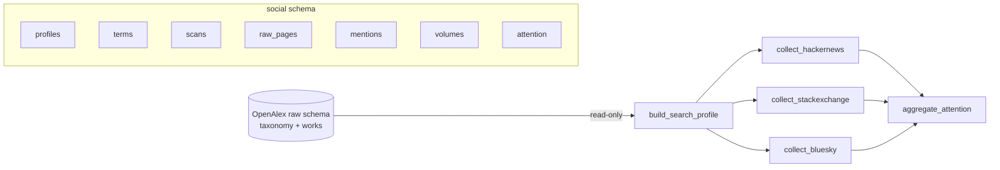

# Collection design

## Why social media

Per [trends-01 research](../../vml-trends/docs/agents/research/trends/trends-01-research.md) (§0.1, §3.4, §7.0) a weak signal is intellectual activity with **low mass attention**. Social media measures the second half:

- `mass_attention`, `early_attention_gap`, and mainstreamness `M` need topic attention over time.
- Counts are normalized as `share = mentions(topic, channel, month) / volume(channel, month)`.
- An unavailable source is `missing`, never zero.
- Social media is Low trust: a primary indicator, never sole evidence. Bursts often confirm maturation rather than early emergence.

## Data flow

1. **Profile.** The latest taxonomy bundle plus current in-scope works give the top `SOCIAL_TOPIC_LIMIT` primary topics (or explicit `SOCIAL_TOPIC_IDS`). Terms are the topic name and OpenAlex keywords, normalized and deduplicated. The profile id hashes topics and terms, so unchanged inputs reuse the profile.
2. **Plan.** Each term × channel gets a root window from its covered boundary (or `SOCIAL_COLLECT_FROM`) to the current month start. Only closed months are collected.
3. **Scan.** A leased scan searches the exact phrase in its window:
   - total above `SOCIAL_WINDOW_CAP` on a multi-month window → `split` into two halves;
   - single month above the cap → `truncated`; the platform total is kept in `reported_total`;
   - otherwise → `complete`.
   Every response is stored in `raw_pages` before parsing. Items are kept only when the normalized phrase occurs in the item's own text (comments ignore their parent title).
4. **Volumes.** Monthly channel totals (HN stories + comments, Stack Exchange questions) for share normalization.
5. **Aggregate.** `attention` is rebuilt for the profile: distinct mentions, authors, engagement, `estimated` (lower bound including truncated totals), `share`, and `coverage`.

## Coverage

| Value | Meaning |
| --- | --- |
| `complete` | every topic term observed in the month, no cap hit |
| `truncated` | observed, but at least one term hit the cap; `estimated` uses the platform total |
| `partial` | some topic terms not observed yet |
| `missing` | nothing observed (disabled, no credentials, or not reached) |

## Budget and failures

- `SOCIAL_REQUEST_BUDGET` caps requests per platform per run, retries included. When exhausted, the claimed scan returns to `pending`.
- Stack Exchange: `backoff` is honored; `throttle_violation` or zero quota stops the platform for this run. Without a key the quota is 300 requests/day; a free app key gives 10 000.
- A failed scan retries on later runs, up to three attempts. Five consecutive failures abort the op.
- Errors store only the exception class; request locators never contain keys or tokens.

## Privacy

Author identifiers are stored only as SHA-256 hashes. They are needed for author diversity, not identity.
