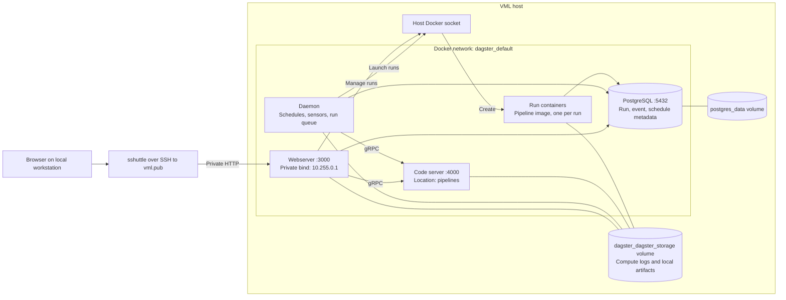

# VML Dagster

Containerized data pipelines on VML, deployed with Docker Compose. Dagster uses
separate infrastructure and pipeline images, with one container per run and up
to four concurrent runs.

## Deployed architecture



Only the webserver publishes a host port, bound to `HOST_INT_IP`. PostgreSQL,
the code server, and run containers publish no host ports. The UI has no login;
access relies on the private network and SSH tunnel.

## Deploy and use

Configure the root `.env` with `USERNAME`, `HOSTNAME`, `TARGET_DIR`, and
`HOST_INT_IP`. The remote host needs Docker Compose, Python 3, and the private
address configured. The SSH account needs Docker access and passwordless sudo
for directory setup. See the [tunnel setup](sshuttle/README.md).

From the repository root:

```bash
./dagster/deploy.sh
```

The script builds images remotely, preserves database credentials and data
volumes, and waits for healthy services. Open <http://10.255.0.1:3000> through
the tunnel and launch `deployment_smoke_test`.

- [Deployment directory layout](docs/deployment-layout.md)
- [Pipeline development and deployment](docs/dags-development.md)
- [Deployment configuration and operations](dagster/README.md)
- [SSH tunnel setup](sshuttle/README.md)
